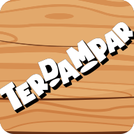
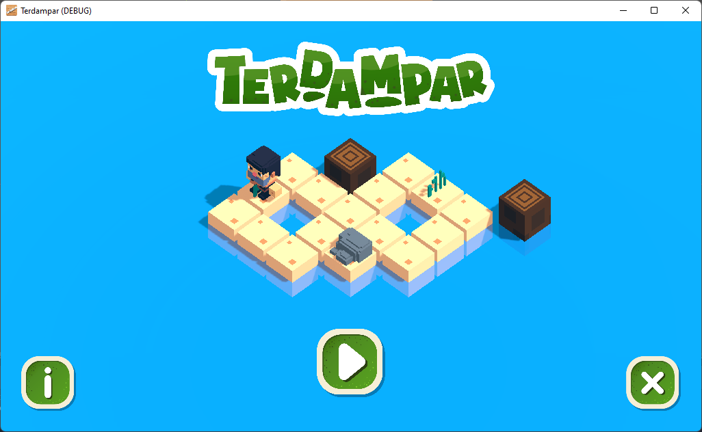
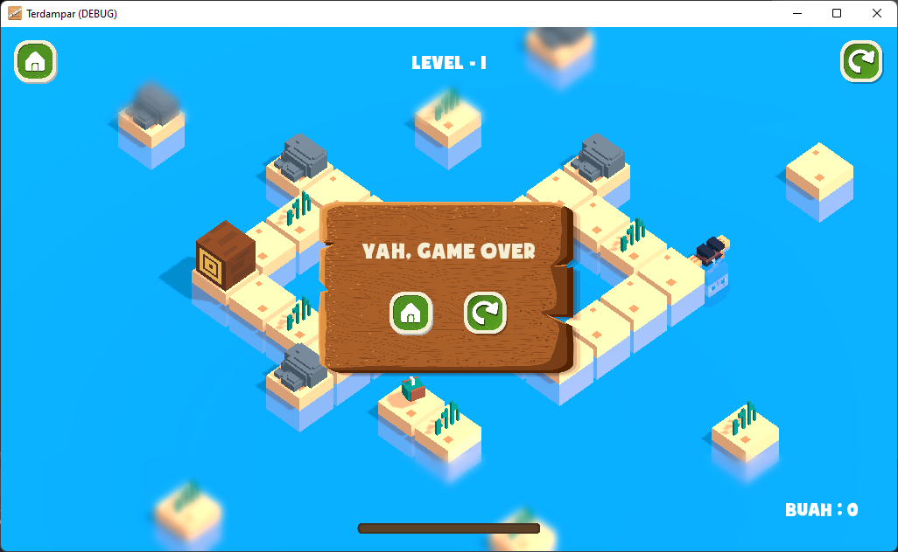

# Game Terdampar
Game bergenre puzzle. Makan buah untuk tetap hidup. Dibuat dengan menggunakan Godot Engine.

## Mata Kuliah
Mata Kuliah : Pengembangan Aplikasi Game  
Dosen Pengampu : Dewi Tresnawati, S.Si, M.T.  

Pembuat : Kelompok 6  
         - Ridwan Muhammad Daud	(1506103)  
         - Ilham Syahidatul Rajab	(1806043)  
         - Asep Kurniawan	(1806044)  
         - Muhammad Ihsan Riyadhi	(1806046)  
         - Ghina Ambarrona Rosita	(1806071)    

### Halaman Awal (Scene Home)

### Halaman Level (Scene Level)

### Halaman Game Over (Scene Game Over)

## Assets
### Graphic #1 - Karakter
Author : RGS_Dev  
Link : <a href="https://rgsdev.itch.io/animated-voxel-character-for-3d-shooter-games-by-rgsdev" target="_blank">Animated Voxel Character by RGS_Dev (itch.io)</a>  
Dibuat ulang dengan menggunakan software MagicaVoxel karena menghilangkan senjata.  

### Graphic #2 - Pantai
Author : Kyrise  
Link : <a href="https://kyrise.itch.io/kyrises-voxel-beach-environment-pack" target="_blank">Kyrise's Free Voxel Beach Environment Pack Low Poly by Kyrise (itch.io)</a> 
Yang digunakan hanya pasir dan rumput.  

### Graphic #3 - Rumput dan Bunga
Author : Kyrise  
Link : <a href="https://kyrise.itch.io/kyrises-voxel-forest-environment-pack" target="_blank">Kyrise's Free Voxel Forest Environment Pack Low Poly by Kyrise (itch.io)</a>  
Yang digunakan rumput dan bunga.  

### Graphic #4 - Pohon
Author : Odd1ln  
Link : <a href="https://theodd1in.itch.io/voxel-trees" target="_blank">Voxel Trees by Odd1In (itch.io)</a>  

### Graphic #5 - Batu
Author : PabloGameDev  
Link :<a href="https://pablogamedev.itch.io/free-isometric-ature-voxel-enviroment" target="_blank"> Free isometric enviroment : Vegetatión, trees and rocks. by PabloGameDev (itch.io)</a>  
Yang diambil hanya batu.  

### Graphic #6 - User Interface
Author : Free Game Assets  
Link : <a href="https://free-game-assets.itch.io/free-jungle-cartoon-gui" target="_blank">Free Jungle Cartoon GUI by Free Game Assets (GUI, Sprite, Tilesets) (itch.io)</a> 

### Font #1 - Superstar Font
Author : Memesbruh03  
Link : <a href="https://www.dafont.com/superstar-2.font" target="_blank">Superstar Font | dafont.com</a>  

### Font #2 - iCielSoupofJustice Font
Author : FFonts  
Link : <a href="https://www.ffonts.net/iCielSoupofJustice.font" target="_blank">iCielSoupofJustice Font | ffonts.net</a>  

### Sound - Sound Effect
Author : Mixkit  
Link : <a href="https://mixkit.co/free-sound-effects/" target="_blank">Mixkit</a>  
