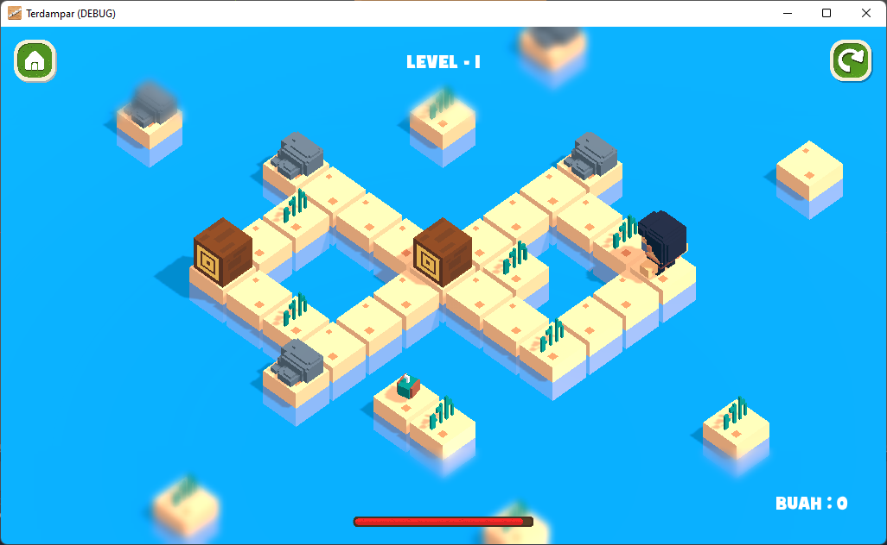

# Game Terdampar
Game bergenre puzzle. Dibuat dengan menggunakan Godot Engine.

# Mata Kuliah
Mata Kuliah : Pengembangan Aplikasi Game  
Dosen Pengampu : Dewi Tresnawati, S.Pt., M.T.  

Pembuat : Kelompok 6  
         - Ridwan Muhammad Daud	(1506103)  
         - Ilham Syahidatul Rajab	(1806043)  
         - Asep Kurniawan	(1806044)  
         - Muhammad Ihsan Riyadhi	(1806046)  
         - Ghina Ambarrona Rosita	(1806071)    

### Halaman Awal (Scene Home)

### Halaman Level (Scene Level)

### Halaman Game Over (Scene Game Over)

